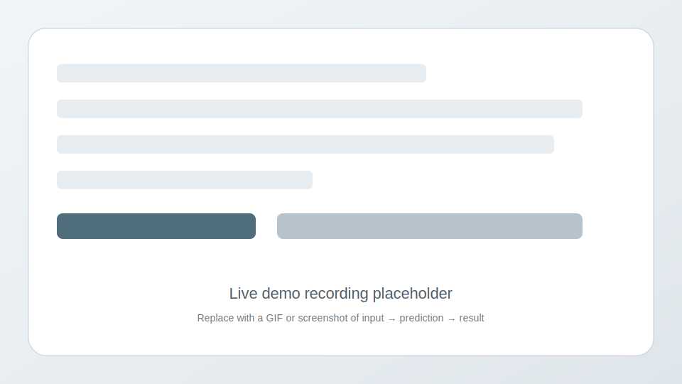

# Customer Churn Prediction Web App

[](https://github.com/TumeloKonaite/Customer-Churning-Repo/actions/workflows/ci.yml)
[](LICENSE)
[](https://www.python.org/)
[](#development-status)
[](https://docs.github.com/en/get-started/quickstart/github-flow)
[](#docker-quick-start)

## Overview
This Flask web application predicts customer churn using a scikit-learn model. Users enter customer attributes via a simple UI, and the app returns whether the customer is likely to churn along with guidance for retention actions.

Training is notebook-independent via a pipeline and a CLI-style entrypoint. It saves model artifacts and metadata (including evaluation metrics and feature schema) under `artifacts/`.

## Features
- User-friendly input form for customer data
- Real-time churn prediction
- Actionable output (high risk vs. low risk)
- Preprocessing + model bundled into a single pipeline artifact
- Docker support for easy deployment (exposes port 5001)

## Retention Decisioning (ROI Layer)
The app includes a lightweight, deterministic decision engine that turns churn probability into a recommended retention action and a simple ROI proxy. It estimates CLV using a balance and tenure-based heuristic, assigns actions using fixed probability thresholds, and computes expected net gain as:

```
net_gain = (p_churn * clv) - action_cost
```

All assumptions and thresholds are documented in `src/decisioning.py`.

## Live Demo


This demo shows the full flow:
- user enters customer attributes
- submits the form
- receives a churn prediction with confidence score and guidance

## Quickstart

### 1. Set up a virtual environment
Choose **one** option:

**Option A: using uv (recommended)**
```bash
uv venv
source .venv/bin/activate
uv pip install -r requirements.txt
```

**Option B: using Python venv**
```bash
python -m venv .venv
source .venv/bin/activate
pip install -r requirements.txt
```

### 2. Run common workflows
```bash
make train   # train model and save to artifacts/
make run     # start the web app locally
make test    # run tests
```

### 3. Open the app
Visit: http://localhost:5001

## Model Training
- Entrypoint: `src/train.py` (runs the pipeline and writes `artifacts/metadata.json`)
- Pipeline: `src/pipeline/training_pipeline.py`
- Output artifacts:
  - `artifacts/model.pkl`
  - `artifacts/metadata.json`
  - `artifacts/schema.json`
  - `artifacts/feature_columns.json`

## Docker Quick Start

### Using Docker Compose (Recommended)
```bash
docker-compose up --build
```

### Using Docker Directly
```bash
# Build the image
docker build -t churn-predictor .

# Optional: pre-train during build to avoid startup delays
# docker build --build-arg RUN_TRAINING=1 -t churn-predictor .

# Run the container
docker run -p 5001:5001 churn-predictor
```

Visit http://localhost:5001 to access the application.

### Artifacts + Auto-Training
The app requires model artifacts under `artifacts/` (`schema.json`, `preprocessor.pkl`, `encoder.pkl`, etc.).
If these files are missing, the container will auto-train on startup by default.

- Control this behavior with `AUTO_TRAIN`:
  - `AUTO_TRAIN=1` (default): train if artifacts are missing
  - `AUTO_TRAIN=0`: skip training (prediction will fail if artifacts are absent)

By default, training runs in the background so the server can start quickly. You can
control this with `AUTO_TRAIN_ASYNC`:
- `AUTO_TRAIN_ASYNC=1` (default): train in background
- `AUTO_TRAIN_ASYNC=0`: train synchronously before app starts

You can also pre-train at build time with `RUN_TRAINING=1` (default in compose).
If a volume is mounted, the container will restore artifacts from an internal
image cache on first start to avoid re-training.
Docker Compose uses a named volume `artifacts` so trained files persist across restarts.

## Project Structure
```
Customer-Churning-Repo/
+- .github/
�  +- workflows/
�     +- ci.yml
+- application.py
+- artifacts/
+- dataset/
�  +- Churn_Modelling.csv
+- docs/
�  +- demo-placeholder.svg
+- logs/
+- notebooks/
�  +- Churning problem using multiple Classification Models.ipynb
+- src/
�  +- components/
�  +- metrics.py
�  +- pipeline/
�  +- decisioning.py
�  +- train.py
�  +- utils.py
+- templates/
+- tests/
�  +- test_decisioning.py
�  +- test_metrics.py
�  +- test_training_metadata.py
+- pyproject.toml
+- requirements.txt
+- Makefile
+- README.md
```

## Development Status
Active

## Contributing
1. Create a feature branch
2. Commit changes
3. Open a pull request

## License
MIT � see `LICENSE`.
