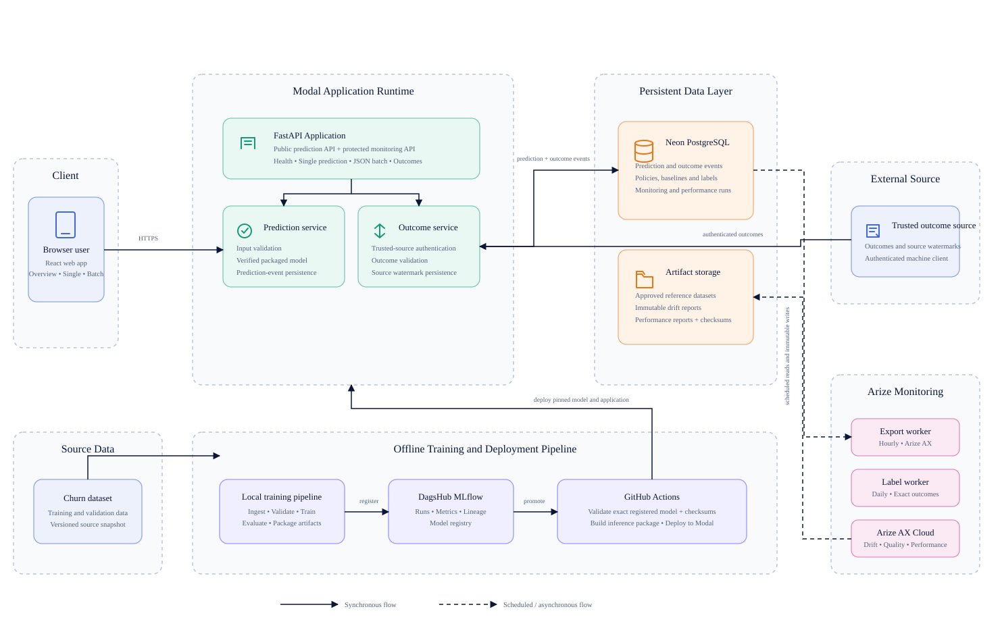

# Customer Churn Prediction Platform

An end-to-end machine learning project that predicts whether a bank customer is likely to churn. It demonstrates the complete path from model training and versioning to a deployed API, React frontend, and production monitoring.

## Architecture



The system has two main paths:

1. The offline pipeline trains and evaluates models, tracks experiments in DagsHub MLflow, and packages an exact model version for deployment.
2. The online platform serves predictions through FastAPI on Modal, stores events in Neon PostgreSQL, and runs scheduled drift and performance checks with Evidently.

## What this project demonstrates

- End-to-end ML training with reusable preprocessing and model pipelines
- Experiment tracking, model lineage, and registry workflows with MLflow
- Reproducible deployment using exact model versions and checksum validation
- Single-customer and JSON batch predictions through a typed FastAPI API
- A responsive React interface for interacting with the model
- Persistent prediction, outcome, and monitoring records in PostgreSQL
- Scheduled data-drift and delayed model-performance monitoring
- Privacy-aware telemetry that excludes direct customer identifiers

## Tech stack

| Area | Technology |
| --- | --- |
| Frontend | React, TypeScript, Vite, Tailwind CSS |
| API | FastAPI, Pydantic |
| Machine learning | scikit-learn, pandas, NumPy |
| Experiment tracking | DagsHub MLflow |
| Database | Neon PostgreSQL, Alembic |
| Monitoring | Evidently, immutable JSON/HTML reports |
| Deployment | Modal, Vercel, GitHub Actions |
| Tooling | uv, pytest, Vitest |

## How predictions work

1. A user submits customer data from the React app or directly to the API.
2. FastAPI validates the request against the model's input contract.
3. The packaged preprocessing pipeline transforms the data and predicts churn probability.
4. The API returns the prediction and records a privacy-safe monitoring event.
5. Scheduled jobs compare production traffic with an approved reference baseline.

### Main API endpoints

| Method | Endpoint | Purpose |
| --- | --- | --- |
| `GET` | `/health` | Check service and model readiness |
| `POST` | `/api/predict` | Predict churn for one customer |
| `POST` | `/api/predict/batch` | Predict churn for a JSON batch |

Outcome-ingestion endpoints are protected and are used by trusted monitoring workflows rather than the public frontend.

## Run locally

### Prerequisites

- Python 3.12
- Node.js 20+
- [uv](https://docs.astral.sh/uv/)

### Backend

```bash
uv sync --locked
cp .env.example .env
uv run uvicorn application:app --reload --port 5001
```

The API documentation is available at `http://localhost:5001/docs`.

### Frontend

```bash
cd frontend
npm install
cp .env.example .env.local
npm run dev
```

The frontend is available at `http://localhost:5173`.

### Train a model

```bash
uv run python -m src.train train --config configs/training.yaml
```

Local training works without a tracking server. Add the DagsHub MLflow variables from `.env.example` to enable remote experiment tracking and model registration.

## Test the project

```bash
uv run pytest -q
cd frontend
npm test
npm run build
```

## Repository map

```text
frontend/            React prediction workspace
src/api/             FastAPI routes and request contracts
src/components/      Data ingestion, validation, training, and evaluation
src/pipeline/        Training and inference orchestration
src/mlops/           Model registry and deployment packaging
src/database/        Persistence layer and repositories
src/monitoring/      Drift, labels, and performance workflows
configs/             Versioned training and monitoring configuration
migrations/          PostgreSQL schema migrations
tests/               Backend test suite
```

## Further documentation

- [Frontend setup and deployment](frontend/README.md)
- [Monitoring overview](docs/monitoring/README.md)
- [Data-quality and drift jobs](docs/monitoring/data-quality-drift-jobs-v1.md)
- [Outcome labels and performance](docs/monitoring/outcomes-labels-performance-v1.md)
- [Production monitoring contract](docs/monitoring/production-monitoring-contract-v1.md)

## License

This project is available under the [MIT License](LICENSE).
